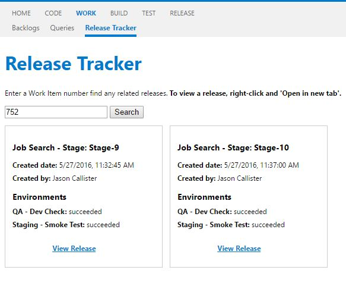

# TFS Release Tracker

As of Team Foundation Server 2015 Update 2.1, there's is no built-in feature to track Work Items by Release. i.e. The common question from Project Management would be  'Has Work Item 555 been released yet? Which environments?'

The repository is contains two projects:

##TFS extension 

The extension is fairly simple. Ideally it'd directly modify the Work Item template however there is no support in place to do this for on-premise installations.

Instead, the extension adds a new tab to the 'Work' section. A user can search by a Work Item number, which in turn makes an API call to the API project. The result is a collection of related releases and status per release environment.

###Installation
1. Navigate to: `http://servername:8080/tfs/_gallery/manage`
2. Upload New Extension, and select the .vsix file from the TFS Extension folder

##Web API project.

The API project is a little more involved. Presently, TFS relates Work Items to Builds, and Builds to Releases, but no direct relationship of Work Item to Release exists.

The API runs a SQL query directly against the Team Project Collection, and ultimately returns a collection of 'Releases'.

There's no SDK available yet, at least one which includes the newer Release components.

###Installation

1. Add values to the following in your web.config
	- `default` connection string - e.g to your TFS Team Project database
	- `TfsUrlAndCollectionName` - e.g http://servername:port/tfs/DefaultCollection/
	- `NetworkUser`
	- `NetworkPassword`
	- `NetworkDomain`
2. Create an IIS site for the .WebUI project. **Ensure that the binding is `http://releasetracker`** as the TFS Extension calls this API.
3. Add an entry to your host file so the name resolves to IIS, and all user host files so the same binding resolves to the host server IP. e.g.
	- TFS Server host file: `releasetracker 127.0.0.1`
	- Server host file: `releasetracker 192.168.0.5` (the TFS Server host IP)

###Disclaimer
This is a **temporary** solution while Microsoft develop an official SDK and/or feature. Use at your own risk.

Built using Visual Studio 2015.
